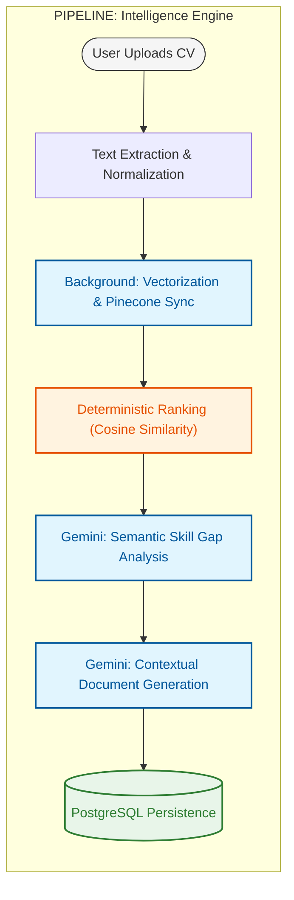

# AIAA Backend Engine ⚙️

**AI Job Application Agent (AIAA)** is a high-performance, production-grade backend engine engineered to automate the job application lifecycle. Built with a focus on low-latency AI processing, deterministic candidate ranking, and scalable document management.

---

## 🚀 Core Features

*   **Hybrid Evaluation Logic** — Combines deterministic **Cosine Similarity** on high-dimensional vectors with **Gemini-powered** semantic reasoning.
*   **Asynchronous AI Pipeline** — Non-blocking document processing using FastAPI `BackgroundTasks` for seamless user experiences.
*   **Vector Infrastructure** — Integrated with **Pinecone** for high-speed vector storage and SHA-256 hashed caching for job description embeddings.
*   **Intelligent Document Parsing** — Automated extraction and structured normalization of complex CV/Resume formats into actionable JSON entities.
*   **Enterprise-Grade Security** — Robust JWT-based authentication system featuring a dual Access and Refresh token architecture.
*   **Cloud Document Management** — Secure, persistent storage for candidate documents integrated with Supabase/PostgreSQL.

---

## 🏛️ System Architecture

AIAA bridges the gap between raw document data and intelligent career insights using a multi-stage AI pipeline.



### Technical Workflow
1.  **Ingestion**: Document text is extracted and normalized into structured JSON.
2.  **Vectorization**: Full-text embeddings are generated via `models/gemini-embedding-001` and synchronized with **Pinecone**.
3.  **Ranking**: Match scores are calculated using **Cosine Similarity** between CV and Job Description vectors, ensuring objective ranking.
4.  **Reasoning**: Gemini-2.5-Flash performs a semantic audit to identify "Critical" vs "Optional" skill gaps based on the job context.
5.  **Generation**: Automated generation of JD-aligned Cover Letters and ATS-optimized CVs.

---

## 🛠️ Technology Stack

| Layer | Technology |
|---|---|
| **Framework** | FastAPI (Python 3.10+) |
| **Generative AI** | Google Gemini (Gemini 2.5 Flash) |
| **Vector Database** | Pinecone |
| **Embeddings** | Google Generative AI Embeddings |
| **Database** | PostgreSQL + SQLAlchemy (Async) |
| **Cloud Storage** | Supabase Storage |
| **Migrations** | Alembic |
| **Containerization** | Docker & Docker Compose |

---

## 🔧 Optimization & Performance

*   **Vector Caching**: Uses SHA-256 hashing on Job Descriptions to reuse pre-computed embeddings, reducing API latency and costs.
*   **Non-Blocking I/O**: Heavy AI tasks (embeddings, storage sync) are offloaded to background threads to maintain sub-second API response times.
*   **Structured Output**: Enforces strict JSON schemas for LLM responses to ensure data integrity across the frontend.

---

## 🚦 Getting Started

### Environment Configuration

Configure your `.env` in the `backend/` directory using the provided `.env.example`:

```ini
# Core Configuration
SECRET_KEY="your_secure_secret_key"
ALGORITHM="HS256"

# Database & Storage
DATABASE_URL="postgresql+asyncpg://user:pass@db:5432/aiaa"
SUPABASE_URL="your_supabase_url"
SUPABASE_KEY="your_supabase_key"

# AI Infrastructure
GEMINI_API_KEY="your_google_gemini_api_key"
PINECONE_API_KEY="your_pinecone_api_key"
PINECONE_INDEX_NAME="aiaa-index"
```

### Deployment (Docker)

The fastest way to deploy the production stack:

```bash
docker-compose up --build -d
```

### Manual Development Setup

1.  **Initialize Environment**:
    ```bash
    python -m venv .venv
    source .venv/bin/activate  # Or .venv\Scripts\activate on Windows
    pip install -r backend/requirements.txt
    ```
2.  **Execute Migrations**:
    ```bash
    alembic upgrade head
    ```
3.  **Launch Server**:
    ```bash
    uvicorn app.main:app --reload
    ```

---

## 📚 API Documentation

AIAA exposes a fully documented RESTful API with automated schema generation:

*   **Interactive Swagger UI**: `http://localhost:8000/docs`
*   **Standard ReDoc**: `http://localhost:8000/redoc`

---

## 📂 Project Structure

```text
app/
├── api/          # API Route Controllers & Dependency Injection
├── core/         # Global Config, Security, & AI Init
├── db/           # Session Management & Migrations
├── models/       # SQLAlchemy Domain Models
├── schemas/      # Pydantic Data Validation
└── services/     # Core Business Logic & AI Pipelines
```

