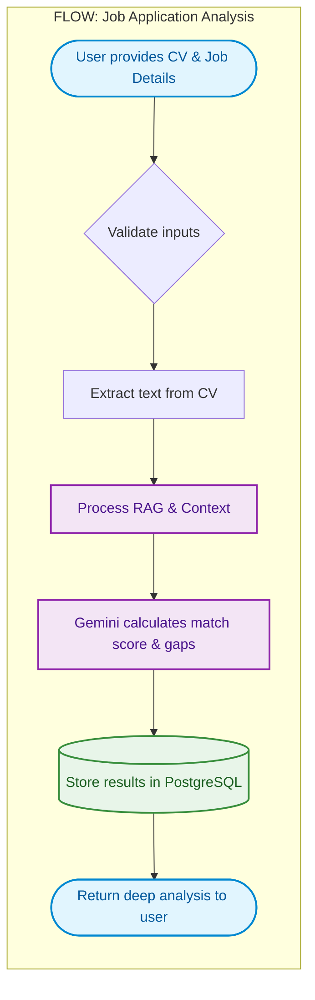

# AIAA Backend Engine ⚙️

**AI Job Application Agent (AIAA)** is a robust, production-grade backend built with FastAPI. It handles all AI processing, document parsing, and data management to power the intelligent job application tracking and analysis ecosystem.

---

## Features ✨

*   **Intelligent Document RAG** — Retrieval-Augmented Generation for deep and context-aware CV parsing.
*   **Gemini AI Integration** — Powered by Google's latest Gemini models for comprehensive analysis, text generation, and skill extraction.
*   **Advanced Analysis Logic** — Complex algorithmic evaluation to calculate precise candidate matching scores and identify critical skill gaps against job requirements.
*   **Secure Authentication** — Enterprise-grade JWT Access and Refresh token architecture for secure session management.
*   **Database Management** — Structured data persistence using PostgreSQL, managed by SQLAlchemy ORM and Alembic migrations.
*   **Containerized Environment** — Fully dockerized with Docker Compose for seamless, consistent deployments across any environment.

## How It Works ⚙️

AIAA seamlessly bridges the gap between user credentials and job requirements using advanced AI.

<details>
<summary>Click to view the system architecture flow</summary>



</details>

---

## Architecture 🏛️

| Layer | Technology |
|---|---|
| **Web Framework** | FastAPI (Python 3.10+) + Pydantic |
| **Database** | PostgreSQL |
| **ORM & Migrations** | SQLAlchemy + Alembic |
| **Generative AI** | Google Generative AI (Gemini) |
| **Auth & Security** | JWT Authentication |
| **Containerization** | Docker & Docker Compose |

---

## Getting Started 🚀

### Prerequisites

*   **Docker & Docker Compose** (Highly Recommended)
*   **Python 3.10+** (For manual setup)

### Environment Variables

Create a `.env` file in the `backend/` directory (see `.env.example` for reference).

```ini
# Core Configuration
SECRET_KEY="your_secure_secret_key"
ALGORITHM="HS256"

# Database Configuration
DATABASE_URL="postgresql://postgres:password@db:5432/aiaa_db"

# AI Configuration
GEMINI_API_KEY="your_google_gemini_api_key"
```

---

### Docker Deployment (Recommended)

1. Clone this repository.
2. Ensure your `.env` file is properly configured.
3. Build and launch the services:
   ```bash
   docker-compose up --build -d
   ```

### Manual Setup

1. Create and activate a virtual environment:
   ```bash
   python -m venv .venv
   # On Windows:
   .venv\Scripts\activate
   # On macOS/Linux:
   source .venv/bin/activate
   ```
2. Install dependencies:
   ```bash
   pip install -r backend/requirements.txt
   ```
3. Run the application:
   ```bash
   uvicorn app.main:app --reload
   ```

The API will be available at **`http://localhost:8000`**.

---

## API Documentation 📚

Once the application is running, the interactive API documentation is automatically generated and accessible via:

*   **Swagger UI**: `http://localhost:8000/docs`
*   **ReDoc**: `http://localhost:8000/redoc`

### Core Project Structure 📂

*   `app/api/`: API endpoints and routing logic.
*   `app/core/`: Application configuration, security, and AI service initialization.
*   `app/models/`: SQLAlchemy database schemas.
*   `app/schemas/`: Pydantic models for request/response validation.
*   `app/services/`: Core business logic and external integrations.
